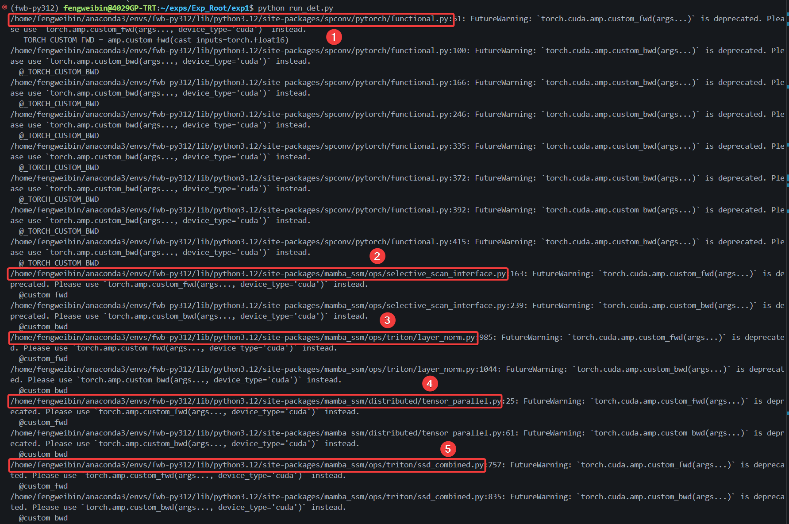
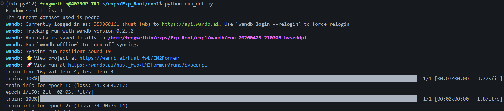

## 数据集下载及处理

在实验根目录**`$Exp_Root`**下的**`$dataset根目录`**中预留**`至少60G`**的磁盘空间！！！

1. 下载。PEDRo数据集，下载链接(https://zenodo.org/records/13331985)，下载到本地数据集根目录(**`$dataset`**)中，共有四个文件(**`info.txt`**，**`numpy.zip`**，**`xml.zip`**，**`yolo.zip`**)。

2. 解压。分别解压**`numpy.zip`**和**`yolo.zip`**压缩文件，解压后为**`numpy文件夹`**和**`yolo文件夹`**，命令如下：

   ```bash
   cd $Exp_Root/dataset  # 将当前工作目录切换至dataset根目录中
   unzip numpy.zip
   unzip yolo.zip
   ```

3. 处理。在**`numpy文件夹`**中**`./numpy/test/frame0002258.npy`**文件因目标为空，务必**`移除`**，否则程序会报错。命令如下：

   ```bash
   rm ./numpy/test/frame0002258.npy
   rm info.txt numpy.zip yolo.zip xml.zip
   ```

4. 更名。将**`numpy文件夹`**更名为**`raw`**，在**`$dataset`**中分别创建**`pedro文件夹`**和**`annotations文件夹`**。命令如下：

   ```bash
   mv ./numpy ./raw
   mkdir -p ./pedro
   mkdir -p ./annotations
   ```

5. 移动。step1：将**`yolo文件夹`**移动到**`$dataset/annotations/`**文件夹中；step2：将**`$dataset/annotations/`**文件夹移动到**`$dataset/raw/`**文件夹中；step3：将**`$dataset/raw/`**文件夹移动到**`$dataset/pedro/`**文件夹中。命令如下：

   ```bash
   mv ./yolo ./annotations/  # step1
   mv ./annotations ./raw/  # step2
   mv ./raw ./pedro/  # step3
   ```

6. 规范化后的**`PEDRo数据集目录`**如下：

   ```bash
   . # 数据集根目录dataset
   ├── pedro  # PEDRo数据集名称
   │   └── raw
   │       ├── annotations
   │       │   └── yolo
   │       │       ├── test
   │       │       │   ├── frame0000000.txt
   │       │       │   ├── frame0000001.txt
   │       │       │   		:
   │       │       │   └── frame0003822.txt
   │       │       ├── train
   │       │       │   ├── frame0000000.txt
   │       │       │   ├── frame0000001.txt
   │       │       │   		:
   │       │       │   └── frame0019227.txt
   │       │       └── val
   │       │           ├── frame0000000.txt
   │       │           ├── frame0000001.txt
   │       │           		:
   │       │           └── frame0003949.txt
   │       ├── test
   │       │   ├── frame0000000.npy
   │       │   ├── frame0000001.npy
   │       │   		:
   │       │   └── frame0003822.npy
   │       ├── train
   │       │   ├── frame0000000.npy
   │       │   ├── frame0000001.npy
   │       │   		:
   │       │   └── frame0019227.npy
   │       └── val
   │           ├── frame0000000.npy
   │           ├── frame0000001.npy
   │           		:
   │           └── frame0003949.npy
   ```


## Python环境配置

确保**`cuda版本`**为**`11.8`**！！！，使用linux系统为Ubuntu 20.04(影响不大)。

1. conda创建并激活新环境**`fwb-py312`**，命令如下：

   ```bash
   conda create -n fwb-py312 python=3.12.12 -y
   conda activate fwb-py312  # 旧版conda激活命令为：source activate py312
   ```

2. **`PyTroch`**相关库安装。命令如下：

   ```bash
   pip install torch==2.4.0 torchvision==0.19.0 torchaudio==2.4.0 --index-url https://download.pytorch.org/whl/cu118
   
   # 或者使用清华源镜像下载，速度差不多
   pip install torch==2.4.0 torchvision==0.19.0 torchaudio==2.4.0 --index-url https://download.pytorch.org/whl/cu118 --extra-index-url https://pypi.tuna.tsinghua.edu.cn/simple
   ```

3. **`PyG`**相关库安装(依赖于torch版本，务必按照以上安装库流程走！！！)。命令如下：

   ```bash
   # step 1
   pip install pyg_lib==0.4.0 torch_scatter==2.1.2 torch_sparse==0.6.18 torch_cluster==1.6.3 torch_spline_conv==1.2.2 -f https://data.pyg.org/whl/torch-2.4.0+cu118.html
   
   # step 2
   pip install torch_geometric==2.6.0
   ```

4. **`detectron2==0.6`**安装。

   - 方案一(推荐)：直接从根目录**`$Exp_Root`**中已编译的**`detectron2-0.6-cp312-cp312-linux_x86_64.whl`**文件安装，命令如下：

      ```bash
      # step 1
      pip install detectron2-0.6-cp312-cp312-linux_x86_64.whl
      
      # step 2
      rm detectron2-0.6-cp312-cp312-linux_x86_64.whl
      ```

   - 方案二(从源码安装)命令如下：

      ```bash
      # step 1
      cd $CONDA_PREFIX/lib/python3.12/site-packages  # 将当前工作目录切换至conda环境(fwb-py312)的site-packages中
      
      # step 2
      git clone https://github.com/facebookresearch/detectron2
      
      # step 3
      pip install -e ./detectron2 --no-build-isolation
      ```

5. **`Mamba==2.2.2`**相关依赖库安装。操作如下：

   - **`causal_conv1d==1.4.0`**下载(推荐方案一)。方案一：需手动下载.whl文件。浏览器访问地址：https://github.com/Dao-AILab/causal-conv1d/releases/tag/v1.4.0/。搜索**`causal_conv1d-1.4.0+cu118torch2.2cxx11abiFALSE-cp312-cp312-linux_x86_64.whl`**文件，将此文件下载到本地并传到服务器当前工作目录中。方案二：在当前工作目录中使用以下命令下载(建议有加速器最优)：

     ```bash
     wget https://github.com/Dao-AILab/causal-conv1d/releases/download/v1.4.0/causal_conv1d-1.4.0+cu118torch2.2cxx11abiFALSE-cp312-cp312-linux_x86_64.whl
     ```

   - **`Mamba==2.2.2`**下载(推荐方案二)。方案一：需手动下载.whl文件。浏览器访问地址：https://github.com/state-spaces/mamba/releases/tag/v2.2.2。搜索**`mamba_ssm-2.2.2+cu118torch2.4cxx11abiFALSE-cp312-cp312-linux_x86_64.whl`**文件，将此文件下载到本地并传到服务器当前工作目录中。方案二：在当前工作目录中使用以下命令下载(比较快)：

     ```bash
     wget https://github.com/state-spaces/mamba/releases/download/v2.2.2/mamba_ssm-2.2.2+cu118torch2.4cxx11abiFALSE-cp312-cp312-linux_x86_64.whl
     ```

   - 安装命令如下：

     ```bash
     # step 1
     pip install causal_conv1d-1.4.0+cu118torch2.2cxx11abiFALSE-cp312-cp312-linux_x86_64.whl  # 安装causal_conv1d-1.4.0
     
     # step 2
     pip install mamba_ssm-2.2.2+cu118torch2.4cxx11abiFALSE-cp312-cp312-linux_x86_64.whl  # 安装mamba_ssm-2.2.2
     
     # step 3
     rm causal_conv1d-1.4.0+cu118torch2.2cxx11abiFALSE-cp312-cp312-linux_x86_64.whl mamba_ssm-2.2.2+cu118torch2.4cxx11abiFALSE-cp312-cp312-linux_x86_64.whl  # 清理安装文件
     ```

6. **`flash-attn==2.7.1.post4`**下载及安装(推荐方案一)，方案一：需手动下载.whl文件。浏览器访问地址：https://github.com/Dao-AILab/flash-attention/releases/tag/v2.7.1.post4。搜索**`flash_attn-2.7.1.post4+cu11torch2.4cxx11abiFALSE-cp312-cp312-linux_x86_64.whl`**文件，将此文件下载到本地并传到服务器当前工作目录中。方案二：在当前工作目录中使用以下命令下载(建议有加速器最优)。下载及安装命令如下：

   ```bash
   # 下载文件
   wget https://github.com/Dao-AILab/flash-attention/releases/download/v2.7.1.post4/flash_attn-2.7.1.post4+cu11torch2.4cxx11abiFALSE-cp312-cp312-linux_x86_64.whl
   
   # step 1
   pip install flash_attn-2.7.1.post4+cu11torch2.4cxx11abiFALSE-cp312-cp312-linux_x86_64.whl
   
   # step 2
   rm flash_attn-2.7.1.post4+cu11torch2.4cxx11abiFALSE-cp312-cp312-linux_x86_64.whl
   ```

7. 外部依赖库**`dagr==0.0.0`**安装。方案一(推荐)：直接从根目录**`$Exp_Root`**中已编译的**`dagr-0.0.0-cp312-cp312-linux_x86_64.whl`**文件安装。方案二：参考链接https://github.com/uzh-rpg/dagr安装dagr依赖库。

   ```bash
   # step 1
   cd $Exp_Root
   
   # step 2
   pip install dagr-0.0.0-cp312-cp312-linux_x86_64.whl
   
   # step 3
   rm dagr-0.0.0-cp312-cp312-linux_x86_64.whl
   ```

8. 安装根目录**`$Exp_Root`**中必要的**`requirements.txt`**的依赖库(其中包含存在的版本，需保持兼容环境)，命令如下：

   ```bash
   pip install -r requirements.txt
   
   # 或者使用清华源镜像下载，速度更快
   pip install -r requirements.txt -i https://pypi.tuna.tsinghua.edu.cn/simple
   
   pip cache purge  # 清理pip缓存
   ```

9. 可选项(建议改动，不然每次运行程序都会有提醒)，运行程序，spconv和mamba会有如下提醒：

   

   - **`spconv包`**修改如下，ctrl+上图红色区域(1)，将(1)**`/home/fengweibin/anaconda3/envs/fwb-py312/lib/python3.12/site-packages/spconv/pytorch/functional.py`**文件执行如下修正：

     ```bash
     ctrl+f搜索以下代码块(不要去掉前面的空格)：
         import torch.cuda.amp as amp
         _TORCH_CUSTOM_FWD = amp.custom_fwd(cast_inputs=torch.float16)
         _TORCH_CUSTOM_BWD = amp.custom_bwd
         
     将其全部替换为：
         import torch.amp as amp
         _TORCH_CUSTOM_FWD = amp.custom_fwd(device_type='cuda', cast_inputs=torch.float16)
         _TORCH_CUSTOM_BWD = amp.custom_bwd(device_type='cuda')
     
     ctrl+s保存！！！
     ```

   - **`mamba包`**修改如下，ctrl+上图红色区域(2)(3)(4)(5)，将(2)**`/home/fengweibin/anaconda3/envs/fwb-py312/lib/python3.12/site-packages/mamba_ssm/ops/selective_scan_interface.py`**文件、(3)**`/home/fengweibin/anaconda3/envs/fwb-py312/lib/python3.12/site-packages/mamba_ssm/ops/triton/layer_norm.py`**文件、(4)**`/home/fengweibin/anaconda3/envs/fwb-py312/lib/python3.12/site-packages/mamba_ssm/distributed/tensor_parallel.py`**文件、(5)**`/home/fengweibin/anaconda3/envs/fwb-py312/lib/python3.12/site-packages/mamba_ssm/ops/triton/ssd_combined.py`**文件中分别执行如下修正：

     ```bash
     # @custom_fwd--->@torch.amp.custom_fwd(device_type='cuda')
     ctrl+f搜索：
     @custom_fwd
     
     将其全部替换为：
     @torch.amp.custom_fwd(device_type='cuda')
     
     # @custom_bwd--->@torch.amp.custom_bwd(device_type='cuda')
     ctrl+f搜索：
     @custom_bwd
     
     将其全部替换为：
     @torch.amp.custom_bwd(device_type='cuda')
     
     (2)(3)(4)(5)文件修改后务必ctrl+s保存！！！
     ```

   - 修改后运行程序则无警告信息，如下：

     


## 程序运行

1. 实验信息。在实验根目录**`$Exp_Root`**中，可以看到**`exp1、exp2……expN`**代表N个独立实验。
2. 设定GPU_ID。在独立实验exp1、exp2……expN目录下的**`run_det.py`**中，通过在导入包区域的**`os.environ['CUDA_VISIBLE_DEVICES'] = "0"`**来设定。所有实验单卡运行，调节**`引号"0"中的数字`**即可。
3. 数据集路径(**`默认../dataset/代表指定$Exp_Root/dataset/，无特殊需要绝对路径情况不用设置`**)。在独立实验exp1、exp2……expN目录下的**`configs文件夹`**下**`com_params.yaml`**文件中，通过**`data_root_dir`**来设定数据集路径。
4. 其他超参。每次上传更新后，**`所有独立实验的其他超参数已经设定好了`**，无需设置。
5. 启动每个独立实验，命令如下：

```bash
cd $Exp_Root  # 实验根目录

# 运行exp1
cd ./exp1
python run_det.py

# 运行exp2
cd ../exp2
python run_det.py

# 运行exp3
cd ../exp3
python run_det.py
	:
	:
# 运行expN
cd ../expN
python run_det.py
```

## 返回结果

待所有实验运行完后，其结果会自动保存在根目录**`$Exp_Root/output/`**中，将**`output`**打包回传给我就ok。辛苦师弟，非常感谢！！！
