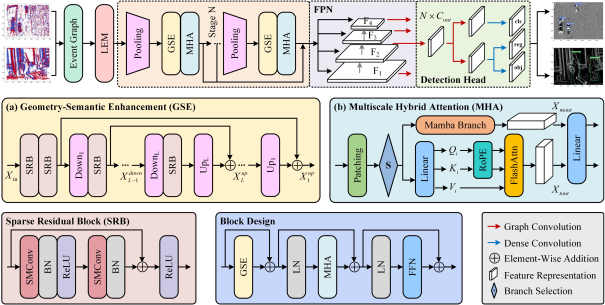

# EM2Former: Geometry-Semantic Enhanced Multiscale Mamba-Transformer Architecture for Event-Based Object Detection

## Overview

We propose EM2Former, a geometric-semantic enhanced hybrid backbone for multiscale feature extraction. Taking event graphs as network inputs, it expands the vertex receptive field via sparse downsampling and recovers geometric details through upsampling, thereby enhancing geometric-semantic perception. To achieve a satisfactory trade-off between modeling efficiency for long event sequences and attention performance benefits, we employ improved Mamba branches in the shallow stages to capture long-range dependencies with low computational overhead, while applying Transformers in deeper layers with drastically reduced token scales to precisely extract contextual relationships. This design fully exploits its complementary strengths, supporting the network's flexible branch selection at different hierarchical levels. 



## Performance

Experimental results on three benchmark datasets demonstrate that our method achieves superior detection accuracy and computational efficiency while preserving the sparsity of event data, offering a new insight for advancing beyond event-driven object detection architectures.


## Installation

### Requirements

Ensure the **CUDA version is 11.8**!!! Use Linux system Ubuntu 20.04 (the impact is not significant).

- Create and activate a new conda environment **py312** with the following commands:

  ```bash
  conda create -n py312 python=3.12.12 -y
  conda activate py312
  ```

- PyTorch 2.4.0 related library installation. Commands as follows:

  ```bash
  pip install torch==2.4.0 torchvision==0.19.0 torchaudio==2.4.0 --index-url https://download.pytorch.org/whl/cu118
  
  # Or use Tsinghua mirror for faster download.
  pip install torch==2.4.0 torchvision==0.19.0 torchaudio==2.4.0 --index-url https://download.pytorch.org/whl/cu118 --extra-index-url https://pypi.tuna.tsinghua.edu.cn/simple
  ```

- **PyG** related library installation (depends on torch version, be sure to follow the above installation steps!!!). Commands as follows:

  ```bash
  # step 1
  pip install pyg_lib==0.4.0 torch_scatter==2.1.2 torch_sparse==0.6.18 torch_cluster==1.6.3 torch_spline_conv==1.2.2 -f https://data.pyg.org/whl/torch-2.4.0+cu118.html
  
  # step 2
  pip install torch_geometric==2.6.0
  ```

- **detectron2==0.6** installation. Compile from source with the following commands: 

  ```bash
  # step 1
  cd $CONDA_PREFIX/lib/python3.12/site-packages  # Switch the current working directory to the site-packages of the conda environment (py312).
  
  # step 2
  git clone https://github.com/facebookresearch/detectron2
  
  # step 3
  pip install -e ./detectron2 --no-build-isolation
  ```

- **Mamba==2.2.2** related dependency library installation. Commands as follows:

  ```bash
  # Download causal_conv1d==1.4.0.
  wget https://github.com/Dao-AILab/causal-conv1d/releases/download/v1.4.0/causal_conv1d-1.4.0+cu118torch2.2cxx11abiFALSE-cp312-cp312-linux_x86_64.whl
  
  # Download Mamba==2.2.2.
  wget https://github.com/state-spaces/mamba/releases/download/v2.2.2/mamba_ssm-2.2.2+cu118torch2.4cxx11abiFALSE-cp312-cp312-linux_x86_64.whl
  
  # step 1
  pip install causal_conv1d-1.4.0+cu118torch2.2cxx11abiFALSE-cp312-cp312-linux_x86_64.whl  # Install causal_conv1d-1.4.0.
  
  # step 2
  pip install mamba_ssm-2.2.2+cu118torch2.4cxx11abiFALSE-cp312-cp312-linux_x86_64.whl  # Install mamba_ssm-2.2.2.
  
  # step 3
  rm causal_conv1d-1.4.0+cu118torch2.2cxx11abiFALSE-cp312-cp312-linux_x86_64.whl mamba_ssm-2.2.2+cu118torch2.4cxx11abiFALSE-cp312-cp312-linux_x86_64.whl  # Clean up installation files.
  ```

- **flash-attn==2.7.1.post4** download and installation. Commands as follows:

  ```bash
  # Download the file.
  wget https://github.com/Dao-AILab/flash-attention/releases/download/v2.7.1.post4/flash_attn-2.7.1.post4+cu11torch2.4cxx11abiFALSE-cp312-cp312-linux_x86_64.whl
  
  # step 1
  pip install flash_attn-2.7.1.post4+cu11torch2.4cxx11abiFALSE-cp312-cp312-linux_x86_64.whl
  
  # step 2
  rm flash_attn-2.7.1.post4+cu11torch2.4cxx11abiFALSE-cp312-cp312-linux_x86_64.whl
  ```

- External dependency library **dagr==0.0.0** installation, please refer to https://github.com/uzh-rpg/dagr to install dagr dependency libraries.

- Install the necessary dependency libraries from **requirements.txt** (keep versions consistent), with the following command:

  ```bash
  pip install -r requirements.txt
  
  # Or use Tsinghua mirror for faster download.
  pip install -r requirements.txt -i https://pypi.tuna.tsinghua.edu.cn/simple
  
  pip cache purge  # Clean pip cache.
  ```

### Dataset Preparation

Download the RSEOD (link: https://github.com/Jushl/ESVT), PEDRo (link: https://zenodo.org/records/13331985), and N-Caltech101 (link: https://www.garrickorchard.com/datasets/n-caltech101) datasets, and move them to the **dataset** folder under the working directory. The normalized dataset directory structure is as follows:

```bash
. # dataset root directory.
├── pedro  # PEDRo dataset name.
│   └── raw
│       ├── annotations
│       │   └── yolo
│       │       ├── test
│       │       │   ├── frame0000000.txt
│       │       │   ├── frame0000001.txt
│       │       │   		:
│       │       │   └── frame0003822.txt
│       │       ├── train
│       │       │   ├── frame0000000.txt
│       │       │   ├── frame0000001.txt
│       │       │   		:
│       │       │   └── frame0019227.txt
│       │       └── val
│       │           ├── frame0000000.txt
│       │           ├── frame0000001.txt
│       │           		:
│       │           └── frame0003949.txt
│       ├── test
│       │   ├── frame0000000.npy
│       │   ├── frame0000001.npy
│       │   		:
│       │   └── frame0003822.npy
│       ├── train
│       │   ├── frame0000000.npy
│       │   ├── frame0000001.npy
│       │   		:
│       │   └── frame0019227.npy
│       └── val
│           ├── frame0000000.npy
│           ├── frame0000001.npy
│           		:
│           └── frame0003949.npy
```

## Quick Start

### Train

Clone the repository to your local machine:

```bash
git clone https://github.com/hust-fstudy/EM2Former
cd EM2Former
```

Once the dataset is specified in the **EVAL_DATASET_DICT** dictionary within the main function of the **run_det.py** file, we can train and validate it using the following command:

```bash
python run_det.py
```

### Test

Download the model weight file: Download **ModelWeights.zip** from the link: https://pan.baidu.com/s/1i8L1HhLm0BL7GwQP4ExJIg (extraction code: **EM2F**), and unzip and move it to the **results** folder under the working directory.

Run and test: We can select a specific dataset by configuring **SEL_DATASET_IDX** in **run_test.py**, and then run the test using the following command:

```bash
python run_test.py
```
